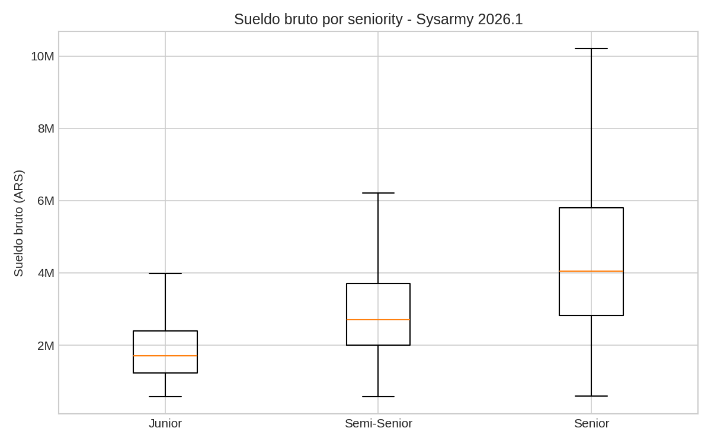
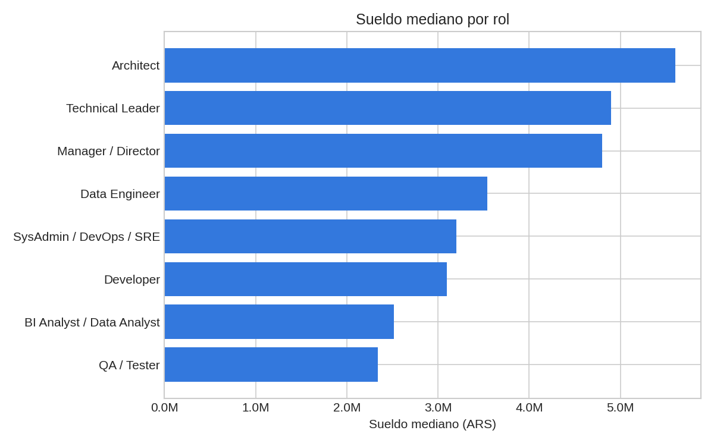

# Sueldos IT Argentina — Dashboard interactivo

Pipeline ETL en Python + dashboard interactivo en Streamlit sobre la Encuesta de
Sueldos IT de Sysarmy. Tiene dos vistas: una foto de la edición actual
(2026.1, 4.939 respuestas) y una **evolución histórica 2020-2026** que muestra
cómo cambiaron los sueldos reales y la brecha de género desde antes de la
cuarentena por COVID-19 hasta hoy.

El objetivo es responder dos preguntas con datos: **¿de qué depende el sueldo
de alguien en IT en Argentina hoy** (seniority, rol, modalidad, ubicación,
género) **y cómo evolucionó eso en los últimos seis años?**

## Pipeline

```
Extract              Transform                Load              Dashboard
CSV Sysarmy   -->    pandas: limpieza,  -->   SQLite      -->   Streamlit
(Google Sheets)       outliers, categorías     (salarios)        (filtros + gráficos)
```

1. **Extract** — dataset público de la encuesta 2026.1 (`data/raw/sueldos_2026_1.csv`).
2. **Transform** (`src/clean.py`) — selecciona columnas relevantes, descarta
   filas sin sueldo, recorta outliers por percentil 1-99, normaliza categorías
   (seniority, género, provincia) y genera columnas derivadas (lenguaje
   principal, bucket de experiencia).
3. **Load** (`src/db.py`) — persiste el dataset limpio en SQLite
   (`data/processed/sueldos.db`, tabla `salarios`).
4. **Dashboard** (`app/streamlit_app.py`) — consulta la base SQLite y expone
   filtros interactivos por seniority, rol, modalidad y provincia.

## Insights clave

Sobre 4.840 respuestas válidas tras la limpieza (se descartó ~2% por outliers
de sueldo):

- **La seniority es el mayor driver de sueldo**: la mediana pasa de ~$2M
  (Junior) a ~$3M (Semi-Senior) a ~$4,3M (Senior) en bruto mensual.
- **Arquitecto, Technical Leader y Manager/Director** son los roles con
  mediana más alta (~$4,9M–$5,6M); QA/Tester y BI/Data Analyst, los más bajos
  entre los roles con volumen relevante.
- **El 100% remoto tiene la mediana más alta** ($3,5M) frente al híbrido
  ($3,28M) y sobre todo al presencial ($2,16M) — aunque esto está mezclado con
  qué roles/empresas ofrecen cada modalidad, no es una relación causal directa.
- **Brecha de género**: la mediana de Hombres Cis ($3,44M) es ~23% más alta
  que la de Mujeres Cis ($2,8M) en la muestra.
- **Go, Java y ABAP** encabezan la mediana por lenguaje principal (con al
  menos 30 respuestas), por encima de Python y JavaScript.
- CABA concentra ~la mitad de las respuestas y tiene la mediana más alta entre
  las provincias con volumen relevante.




## Evolución histórica (2020-2026)

La segunda pestaña del dashboard usa series semestrales que openqube publica
y consolida edición a edición (no es un cálculo propio: son los datos
oficiales de "progresión histórica" de su sitio, extraídos de su reporte
público y guardados en `data/processed/historico_*.csv`).

**Nota sobre el alcance**: openqube solo tiene pre-consolidadas 4 series
históricas — sueldo mediano, participación por género, sueldo por género y
conformidad por género. Por eso esta vista se enfoca en esos ejes. No existe
un histórico armado de modalidad de trabajo (remoto/híbrido/presencial), que
hubiera sido ideal para mostrar el quiebre de la cuarentena; conseguirlo
requeriría procesar a mano el dataset crudo de cada una de las ~12 ediciones
semestrales desde 2020, algo que quedó fuera del alcance de este proyecto.

- **El sueldo real (ajustado por inflación con el IPC del INDEC) subió ~21%**
  entre febrero 2020 y marzo 2026, pese a que en pesos nominales se multiplicó
  por 44x — sin ajustar por inflación, la comparación en pesos no dice nada.
- En agosto 2020 el sueldo real ya mostraba un salto de ~13% respecto de
  febrero de ese año. No hay forma de confirmar con estos datos *por qué*
  (podría ser demanda real de talento remoto, podría ser un cambio en el
  perfil de quién respondió la encuesta en plena cuarentena) — se muestra el
  dato, no una explicación causal.
- **La brecha de género cruda (sin ajustar por rol o seniority) prácticamente
  no se movió**: en febrero 2020 una mujer cis ganaba 83 centavos por cada
  peso de un hombre cis; en marzo 2026, 81 centavos. Esta cifra mezcla
  discriminación salarial real con el hecho de que hay menos mujeres en
  puestos senior/mejor pagos — no equivale a "cobran menos por el mismo
  puesto". openqube reporta en su propio sitio que la brecha se agranda con
  los años de experiencia.
- La participación de mujeres cis en la encuesta subió de ~14% (2020) a ~20%
  (2026), pero eso no se tradujo en una brecha salarial menor.

**Limitaciones a tener en cuenta:**

- Cada edición de la encuesta la responde gente distinta (no es un panel que
  sigue a las mismas personas en el tiempo). Un cambio en la mediana entre
  ediciones puede deberse a que cambió quién respondió (más/menos gente
  senior, de tal o cual rol), no necesariamente a que a cada individuo le
  haya ido mejor o peor.
- La comparación en **dólares blue** no es homogénea en todo el período:
  Argentina mantuvo un cepo cambiario hasta abril de 2025, con una brecha
  grande entre el dólar oficial y el blue (informal). Desde que se levantó el
  cepo, ambas cotizaciones prácticamente se unificaron — se puede ver en los
  propios datos, donde oficial y blue casi coinciden a partir de 2025-08. Por
  eso, comparar "sueldo en dólares blue" de 2021 contra el de 2026 mezcla dos
  regímenes cambiarios distintos.

## Cómo correrlo

```bash
pip install -r requirements.txt

# 1. Limpieza y transformación
python src/clean.py

# 2. Carga a SQLite
python src/db.py

# 3. Dashboard
streamlit run app/streamlit_app.py
```

## Dashboard en vivo

**[sueldos-it-argentina.streamlit.app](https://sueldos-it-argentina-ppprndbhcwn4enxtjyxncn.streamlit.app/)**

## Estructura del repo

```
data/raw/            CSV original de la encuesta 2026.1
data/processed/       dataset limpio (csv) + base SQLite + series históricas 2020-2026
src/clean.py          transform: limpieza y normalización
src/db.py             load: persistencia en SQLite
app/streamlit_app.py  dashboard interactivo (foto actual + evolución histórica)
notebooks/01_eda.ipynb  exploración inicial
assets/                gráficos estáticos usados en este README
```

## Fuente y licencia de los datos

Encuesta de Sueldos IT Argentina, edición 2026.1, realizada por
[Sysarmy](https://sysarmy.com) y procesada/publicada por
[Openqube](https://openqube.io). Datos bajo licencia
Creative Commons Atribución-NoComercial-CompartirIgual 4.0 Internacional.
